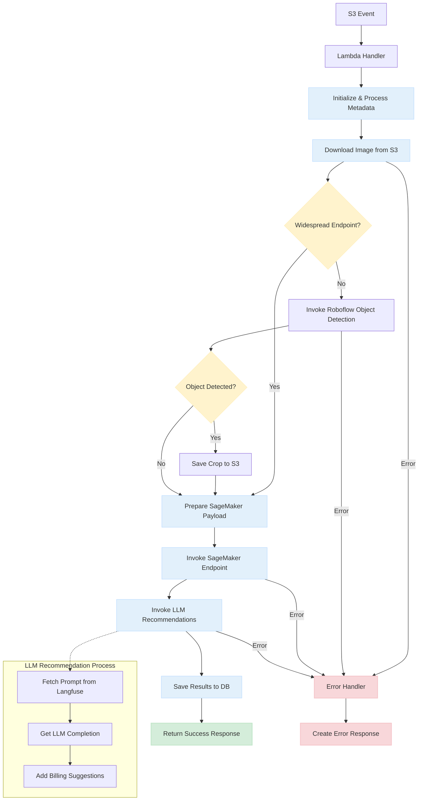

# AIGetInference: Medical Image Diagnostic Workflow

## Executive Summary

The *AIGetInference* Lambda function represents a critical component in a diagnostic imaging pipeline. This serverless microservice orchestrates the automated analysis of medical images to deliver evidence-based diagnostic suggestions to clinicians at the point of care. By leveraging cloud-native architecture and advanced AI models, the system enhances clinical decision-making while maintaining high performance and reliability standards.

## Overview and Purpose

The GetDdxAssistInference service addresses the growing need for AI-assisted medical diagnostics in clinical settings. It serves as a bridge between raw medical imaging data and actionable clinical insights by processing images through specialized AI models and enhancing the outputs with contextual medical recommendations.

## Technical Implementation

The service employs a serverless AWS Lambda architecture triggered by S3 events when new medical images are uploaded. This event-driven approach ensures timely processing of diagnostic images while maintaining cost efficiency through on-demand execution.

## Key Capabilities

### Specialized Model Selection

The system dynamically routes images to specialized AI models based on image metadata and clinical context. This intelligent routing mechanism differentiates between widespread and localized conditions, optimizing analysis precision.

### Precise Region Detection

For conditions requiring localized analysis, the service employs an Object Detection Model to isolate regions of interest, enhancing diagnostic accuracy by focusing model attention on relevant anatomical structures.

### Clinical Context Enhancement

Raw model outputs are enriched through a Large Language Model (LLM) pipeline that translates technical findings into clinically relevant recommendations, including possible diagnoses, suggested follow-up tests, and treatment considerations.

## Integration Points

- **Input**: S3 bucket events triggered by medical image uploads
- **Data Storage**: DynamoDB for metadata persistence and result history
- **ML Infrastructure**: AWS SageMaker for scalable inference
- **Enhancement**: LLM-based clinical recommendation generation

## Business Impact

This service delivers substantial value by:

- Reducing time-to-diagnosis for clinicians reviewing medical images
- Providing consistent second opinions across various medical specialties
- Supporting less experienced practitioners with AI-backed insights
- Creating structured data from unstructured medical images for downstream analytics

## Operational Considerations

The service is designed with reliability as a core principle, featuring comprehensive error handling, detailed operational logging, and performance metrics to ensure consistent service delivery in critical healthcare environments.
