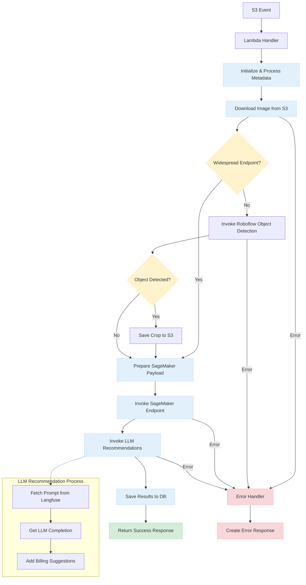

# AIGetInference: Medical Image Diagnostic Workflow

*A retrospective deep-dive on a microservice I built as Founding Engineer / Head of Engineering at HealthyMe AI (2023–2026), a NYC dermatology computer-vision AI startup.*

## Executive Summary

The *AIGetInference* Lambda function was a critical component in the diagnostic imaging pipeline I built. This serverless microservice orchestrated the automated analysis of medical images to deliver evidence-based diagnostic suggestions to clinicians at the point of care. By leveraging cloud-native architecture and AI models, the system enhanced clinical decision-making while maintaining strong performance and reliability.

```mermaid
flowchart TD
    A[S3 Event] --> B[Lambda Handler]
    B --> C[Initialize & Process Metadata]
    C --> H[Download Image from S3]
    H --> I{Widespread Endpoint?}
    I -- Yes --> L[Prepare SageMaker Payload]
    I -- No --> J[Invoke Roboflow Object Detection]
    J --> K{Object Detected?}
    K -- Yes --> KS[Save Crop to S3]
    KS --> L
    K -- No --> L
    L --> M[Invoke SageMaker Endpoint]
    M --> N[Invoke LLM Recommendations]
    N --> O[Save Results to DB]
    O --> P[Return Success Response]
  
    %% Error Handling
    H -- Error --> Error[Error Handler]
    J -- Error --> Error
    M -- Error --> Error
    N -- Error --> Error
    Error --> Q[Create Error Response]
  
    %% Simplified Subprocesses
    subgraph "LLM Recommendation Process"
        N2[Fetch Prompt from Langfuse] --> N3[Get LLM Completion]
        N3 --> N4[Add Billing Suggestions]
    end
  
    N -.-> N2
  
    classDef success fill:#d4edda,stroke:#c3e6cb,stroke-width:2px;
    classDef process fill:#e2f0fb,stroke:#b8daff,stroke-width:1px;
    classDef error fill:#f8d7da,stroke:#f5c6cb,stroke-width:2px;
    classDef decision fill:#fff3cd,stroke:#ffeeba,stroke-width:1px;
  
    class P success;
    class C,H,L,M,N,O process;
    class Error,Q error;
    class I,K decision;
```

## Overview and Purpose

The GetDdxAssistInference service addressed the growing need for AI-assisted medical diagnostics in clinical settings. It served as a bridge between raw medical imaging data and actionable clinical insights, processing images through specialized AI models and enriching the outputs with contextual medical recommendations.

## Technical Implementation

The service used a serverless AWS Lambda architecture triggered by S3 events when new medical images were uploaded. This event-driven approach ensured timely processing of diagnostic images while maintaining cost efficiency through on-demand execution.

## Key Capabilities

### Specialized Model Selection

The system dynamically routed images to specialized AI models based on image metadata and clinical context. This routing mechanism differentiated between widespread and localized conditions to optimize analysis precision.

### Precise Region Detection

For conditions requiring localized analysis, the service used an object detection model to isolate regions of interest, improving diagnostic accuracy by focusing model attention on relevant anatomical structures.

### Clinical Context Enhancement

Raw model outputs were enriched through a Large Language Model (LLM) pipeline that translated technical findings into clinically relevant recommendations, including possible diagnoses, suggested follow-up tests, and treatment considerations.

## Integration Points

- **Input**: S3 bucket events triggered by medical image uploads
- **Data Storage**: DynamoDB for metadata persistence and result history
- **ML Infrastructure**: AWS SageMaker for scalable inference
- **Enhancement**: LLM-based clinical recommendation generation

## Business Impact

This service was designed to deliver value by:

- Reducing time-to-diagnosis for clinicians reviewing medical images
- Providing consistent second opinions across medical specialties
- Supporting less experienced practitioners with AI-backed insights
- Creating structured data from unstructured medical images for downstream analytics

## Operational Considerations

I designed the service with reliability as a core principle, featuring comprehensive error handling, detailed operational logging, and performance metrics to support consistent service delivery in a healthcare environment.
