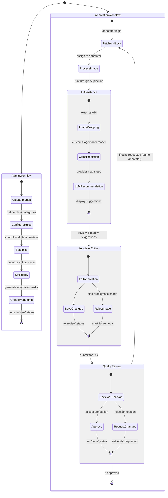
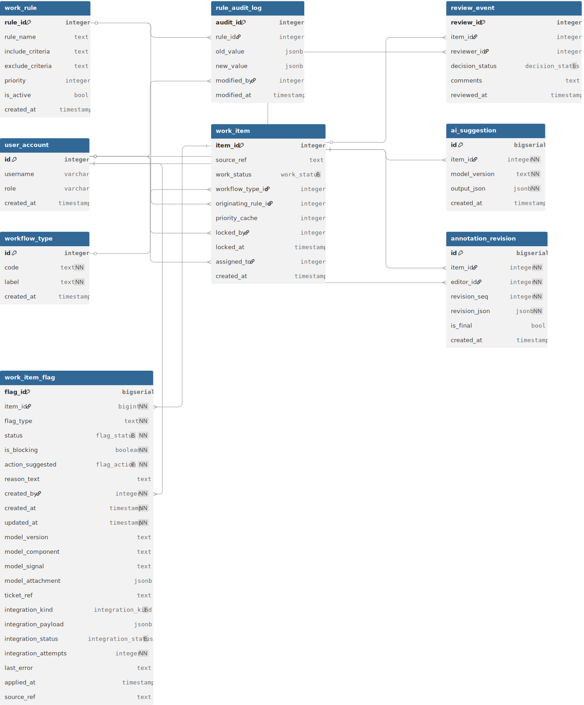

# Data Annotation Application: Multi-User Dermatology Image Annotation Platform

## Executive Summary

This case study details the design and implementation of a high-throughput dermatology image annotation platform that significantly increased annotation efficiency. The system enables dermatologists to classify skin conditions and provide rich-text descriptions through a streamlined workflow with quality control measures. As the architect and technical lead, I designed the complete system architecture and directed the development team while personally implementing the database layer using Flyway for migration management. The platform demonstrates my ability to lead full-stack projects that solve complex domain-specific problems while prioritizing user experience and system efficiency.

## Introduction & Background

Dermatological image analysis requires expert annotation for both clinical decision support and machine learning model development. Existing annotation tools lacked domain-specific workflows and efficiency features needed by dermatologists. This project addressed the need for a specialized platform that could support both classification of skin conditions and detailed descriptive annotations while maintaining high throughput and quality standards.

### Problem Statement

- Generic annotation tools lacked dermatology-specific classification taxonomies
- Previous workflows caused bottlenecks in the annotation review process
- Expert dermatologist time was being used inefficiently
- Quality control mechanisms were insufficient for medical applications

## System Architecture

### Technology Stack

- **Frontend**: React with TypeScript for type safety and component reusability
- **Backend**: Python FastAPI service for annotation logic and workflow management
- **Database**: PostgreSQL with JSON support for flexible annotation schemas
- **Migration**: Flyway for version-controlled database schema evolution
- **Authentication**: OAuth 2.0 with role-based access control
- **Image Processing**: Integrated image processing pipeline for preprocessing and standardization

### Key Components

- Annotation engine with dermatology-specific classification taxonomy
- Multi-stage review workflow with quality assurance gates
- Admin configuration tools for taxonomy and workflow adjustment
- Analytics dashboard for throughput and quality metrics

## Workflow Logic

The annotation platform implements a structured workflow optimized for dermatology image annotation with built-in quality control and AI-assisted features:



### Detailed Workflow Process

1. **Administrative Preparation**

   - Admin uploads dermatology images via dashboard, organizing by classification
   - Creates work rules with limit settings to control annotation volume (cost management)
   - Implements priority structure to ensure critical cases are handled first
   - System generates work items in 'new' status based on these rules
2. **Annotation Assignment**

   - Dermatologist logs in and system locks available items (status → 'in_progress')
   - System associates the work item with the specific annotator
3. **AI-Assisted Preprocessing**

   - Image passes through production AI pipeline:
     - External API for image cropping/standardization
     - Custom-trained Sagemaker model for preliminary classification
     - LLM API integration for generating "provider recommended next steps"
   - Results stored in ai_suggestion table and presented to annotator as starting point
4. **Annotation Process**

   - Annotator reviews and edits AI-generated suggestions as needed
   - Changes saved to annotation_revision table with proper versioning
   - Option to reject problematic images (records in work_item_flag table)
   - Upon completion, status changes to 'review'
5. **Quality Control Review**

   - QC specialist reviews completed annotations
   - Can either approve (status → 'done') or request revisions (status → 'edits_requested')
   - If revisions needed, work item returns only to original annotator
   - Each revision stored with sequential revision_seq tracking
6. **Continuous Improvement**

   - Flagged images processed by backend cleaner for dataset quality maintenance
   - Annotation quality metrics tracked for annotator performance evaluation

## Core Features & Functionality

### Annotation Capabilities

- **Classification System**: Hierarchical taxonomy of dermatological conditions with searchable interface
- **Rich-Text Annotation**: Structured descriptors for lesion characteristics (color, texture, borders, etc.)
- **Region Marking**: Optional highlighting of regions of interest with measurement tools
- **Reference Library**: Integrated access to reference images and classification guidelines

### User Management

- **Role-Based Access**: Distinct permissions for primary annotators, reviewers, and administrators
- **Work Distribution**: Intelligent task assignment based on annotator expertise and workload
- **Performance Tracking**: Individual and team productivity metrics with quality indicators

### Quality Control

- **Multi-Stage Review**: Two-tier review process with expert validation
- **Consistency Checks**: Automated detection of annotation inconsistencies
- **Auto-Assistance**: ML-powered suggestions to accelerate annotation (pre-classification)
- **Annotation Standards**: Enforced structured input for key classification attributes

### Administrative Tools

- **Taxonomy Management**: Interface for updating classification schemas
- **Workflow Configuration**: Customizable rules for task assignment and review paths
- **Quality Reporting**: Comprehensive dashboards for throughput and accuracy
- **Export Capabilities**: Structured data export for research and model training

## Technical Implementation

### Database Architecture

The database architecture was personally designed and implemented with a focus on flexibility, performance, and data integrity. PostgreSQL was selected for its robust JSON capabilities while maintaining relational integrity.

#### Key Design Decisions:

- **Hybrid Schema**: Core entities in normalized tables with flexible annotation content in JSON
- **Optimized Queries**: Indexed JSON paths for efficient filtering and searching
- **Audit Trail**: Comprehensive change tracking with temporal queries
- **Trigger Functions:** Automate state changes according to dataflow within the schema itself
- **Version Control**: All schema changes managed through Flyway migrations

<!-- ```sql
-- Example schema snippet showing the core annotation table
CREATE TABLE annotations (
  id text PRIMARY KEY,
  image_id text NOT NULL REFERENCES images(id),
  annotator_id text NOT NULL REFERENCES users(id),
  classification jsonb NOT NULL, -- Hierarchical classification
  description jsonb NOT NULL,    -- Structured descriptors
  regions jsonb,                 -- Optional region markings
  status text NOT NULL,
  created_at timestamp with time zone NOT NULL DEFAULT now(),
  updated_at timestamp with time zone NOT NULL DEFAULT now(),
  CONSTRAINT valid_status CHECK (status IN ('draft', 'submitted', 'in_review', 'revision_requested', 'approved'))
);
``` -->

<p align="center">
  
</p>

### API Design

The API layer was architected using RESTful principles with a domain-driven approach, clearly separating core domain logic, workflow management, and administrative operations. The design emphasized modularity and proper separation of concerns while ensuring robust authentication and authorization throughout.

#### Core API Organization

1. **Resource-Oriented Endpoints**

   - `/annotations/*` - Core annotation operations (creation, updates, search)
   - `/tasks/*` - Task management and workflow state transitions
   - `/review/*` - Quality control and approval processes
   - `/admin/*` - Administrative configuration and monitoring
2. **Workflow-Specific Endpoints**

   - Task assignment and locking
   - Review queue management
   - State transitions with proper validation
   - Heartbeat mechanisms to maintain task locks
3. **Administrative Endpoints**

   - Rule-based task prioritization configuration
   - Queue management and monitoring
   - User task management and reassignment
   - Performance and quality metrics

```javascript
// Example route handler showcasing key architectural patterns
router.post('/tasks/:task_id/submit', authenticate, async (req, res) => {
  const client = await pool.connect();
  
  try {
    // Transaction management
    await client.query('BEGIN');
  
    // Authorization and validation
    const userId = req.user.id;
    const { task_id } = req.params;
    const { annotation_data } = req.body;
  
    // Row-level locking prevents race conditions
    const task = await validateTaskOwnership(client, task_id, userId);
  
    // Domain logic execution with proper state transition
    const result = await taskService.submitForReview(client, {
      taskId: task_id,
      userId,
      annotationData: annotation_data
    });
  
    // Audit logging for compliance
    await auditLogger.recordAction(client, {
      userId,
      action: 'TASK_SUBMITTED',
      resourceId: task_id,
      metadata: { previousStatus: task.status }
    });
  
    await client.query('COMMIT');
  
    // Event emission for asynchronous processing
    eventEmitter.emit('task.submitted', { task_id, userId });
  
    return res.json({
      success: true,
      data: result
    });
  } catch (err) {
    await client.query('ROLLBACK');
    return errorHandler(res, err);
  } finally {
    client.release();
  }
});
```

#### API Design Patterns

- **JWT-based Authentication**: Secure access control with role-based permissions
- **Transactional Integrity**: Database transactions for multi-step operations
- **Optimistic Concurrency**: Row-level locking for task assignment
- **Event-Driven Architecture**: Events emitted for asynchronous processing
- **Comprehensive Error Handling**: Structured error responses with appropriate status codes
- **Audit Logging**: All significant actions logged for compliance and debugging

## User Experience Design

### User Personas

#### Primary Annotator (Dermatologist)

- Needs efficient interface to maximize throughput
- Requires specialized terminology and classification options
- Values consistency and quick access to reference materials

#### Reviewer (Senior Dermatologist)

- Focuses on quality control and consistency
- Needs clear comparison views between annotations and source images
- Requires efficient feedback mechanisms

#### Administrator

- Manages workflow rules and user assignments
- Monitors system performance and annotation quality
- Configures classification taxonomies and standards

### Key User Journeys

1. **Primary Annotation Flow**

   - Login and dashboard showing assigned tasks and performance metrics
   - Task selection or automatic assignment based on rules
   - Image viewing with zoom and pan capabilities
   - Classification selection through hierarchical menu
   - Structured descriptor input with autocomplete
   - Submission for review with optional notes
2. **Review Process**

   - Queue of submitted annotations requiring review
   - Side-by-side comparison of image and annotation
   - One-click approval or detailed revision requests
   - Quality metrics tracking for annotators
3. **Administrative Workflow**

   - Dashboard with system-wide metrics
   - User management and task assignment rules
   - Taxonomy editing and version control
   - Batch operations for data export and analysis

## Security & Compliance

### Data Protection Strategy

- **Privacy by Design**: System designed with no patient PII exposure within the application
- **Authentication**: Google OAuth implementation for secure user identity verification
- **Authorization**: Role-based access control for annotators, reviewers, and administrators
- **Audit Trail**: Comprehensive activity logging of all annotation actions with timestamps and user attribution

### Compliance Measures

- **Medical Data Handling**: Ensured compliance with medical data regulations through proper separation of identifiers
- **User Accountability**: Each annotation action traced to specific users for quality assurance
- **Versioning**: Complete revision history maintained for all annotations, preserving the full edit history

## Performance Optimization

### Database Optimizations

- **Materialized Views**: Implemented for commonly accessed data combinations to reduce join overhead
- **Strategic Indexing**: Table indices created for frequent query patterns across annotation workflows
- **Query Tuning**: Optimized key workflow queries for annotation assignment and review processes

### System Performance

- **Lightweight Design**: System architecture balanced for the specific user load requirements
- **Resource Allocation**: Appropriate database configuration for the anticipated concurrent user count

## Technical Challenges & Solutions

### Evolution from Prototype

- **Single User to Multi-User**: Successfully transformed a single-annotator prototype into a full multi-stage workflow system
- **Data Structure Redesign**: Reorganized underlying data model to support the expanded workflow requirements

### Data Quality Assurance

- **Rejection Pathways**: Implemented multiple rejection options for problematic images
- **Source Truth Preservation**: Ensured that approval/rejection decisions were recorded in the source dataset
- **Image Quality Control**: Added specific workflows for identifying incorrectly categorized or unclear images
- **Downstream Integration**: Maintained data integrity for machine learning model training purposes

## Metrics & Monitoring

### Administrative Dashboard

- **Queue Metrics**: Real-time visualization of work items in various states
- **User Productivity**: Tracking of annotation completion rates by user over configurable time periods
- **Quality Indicators**: Monitoring of review outcomes (acceptance vs. rejection rates)

### System Reliability

- **Error Tracking**: Integration with third-party logging services for error aggregation
- **Alert System**: Developer notifications for critical system errors or anomalies
- **Performance Monitoring**: Continuous tracking of response times and system resource utilization

## Project Outcomes & Impact

### Efficiency Improvements

- **Throughput Increase**: Significant reduction in time required per annotation
- **Quality Enhancement**: Improved consistency and accuracy through structured input
- **Resource Optimization**: More effective use of specialist dermatologist time
- **Learning Curve**: Reduced training time for new annotators through intuitive interface

### Technical Achievements

- **Scalable Architecture**: System designed to handle growing image repositories
- **Data Quality**: Robust validation and review processes ensuring high-quality annotations
- **Integration Capability**: APIs designed for seamless integration with ML pipelines
- **Maintainability**: Well-documented, version-controlled database through Flyway

## User Onboarding & Training

### Knowledge Transfer

- **Specialist-Led Training**: Senior dermatologists conduct training for new annotators
- **Documentation**: Comprehensive user guides and workflow documentation
- **Continuous Learning**: Periodic feedback sessions to refine the annotation process

## Future Roadmap

### Technical Improvements

- **Enhanced CI/CD Pipeline**: Streamline development and deployment processes
- **Comprehensive Testing Strategy**: Implement robust automated testing frameworks
- **ML Integration**: Direct pipeline from annotations to model training datasets

### Feature Expansion

- **Additional Annotation Types**: Support for bounding box annotations and temporal data selection
- **Workflow Customization**: Configurable workflows for different annotation needs
- **Advanced Analytics**: More sophisticated reporting on annotation quality and efficiency

## Conclusion

This annotation platform demonstrates my ability to lead the end-to-end design and implementation of complex, domain-specific applications. By taking ownership of the architecture and database design while directing the development team, I delivered a solution that significantly improved annotation throughput for dermatology images.

The project showcases my technical expertise in database design, API development, and workflow optimization, alongside leadership skills in translating domain requirements into technical specifications and guiding implementation. The successful deployment and adoption of this platform highlight my capability to deliver full-stack solutions that provide meaningful business value through technical innovation.
