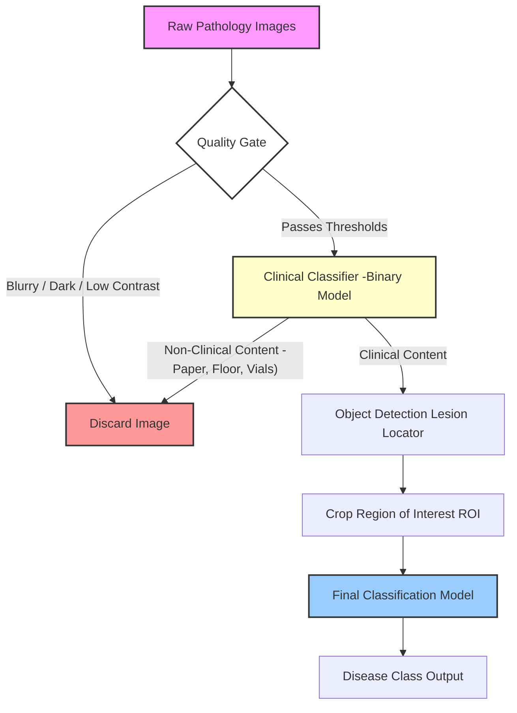

# **End-to-End Data Pipeline for Dermatological Image Classification**

**Domain:** Computer Vision, Healthcare, Data-Centric AI

**Tech Stack:** Python, OpenCV, PyTorch/TensorFlow, Scikit-Learn

## **1\. Executive Summary**

This project involved designing and implementing a production-grade computer vision pipeline to classify dermatological lesions from pathology images.

Initial attempts using standard Transfer Learning failed due to severe data quality issues (irrelevant backgrounds, blur, artifacts) and extreme class imbalance. I shifted the strategy from **Model-Centric** (tuning hyperparameters) to **Data-Centric** (engineering the dataset), building a multi-stage "Quality Gate" and Object Detection pipeline. This transformed a noisy data lake into a curated dataset, enabling the development of accurate diagnostic models.

## **2\. System Architecture**

The following diagram outlines the automated curation pipeline developed to handle raw, unstructured pathology data.



## **3\. The Challenge**

The initial dataset was constructed from historical pathology records and presented significant engineering hurdles:

* **Noisy Labels:** Pathology reports were unstructured, containing misspellings, acronyms, and non-standard descriptions.  
* **Extreme Class Imbalance:** The data followed the "long tail" distribution of diseases in the general population.  
* **High Cardinality:** Initial mapping resulted in over 300 unique disease classes.  
* **Poor Signal-to-Noise Ratio:**  
  * **Artifacts:** Many images were blurry, overexposed, or too dark.  
  * **Irrelevant Context:** Photos often included vials, paperwork, or floors instead of skin.  
  * **Scale Issues:** Small lesions on large body parts (e.g., a small spot on an ear) meant 90%+ of the pixel data was irrelevant background (hair, eyes, background).

*Initial Result:* Standard transfer learning (ResNet, MobileNet) yielded poor results (Top-3/5 accuracy stalled at 40-50%).

## **4\. The Solution: A Data-Centric Pipeline**

To solve the model performance issues, I engineered a three-stage preprocessing pipeline.

### **Phase 1: Label Normalization & EDA**

* Performed **Exploratory Data Analysis (EDA)** and text clustering on pathology reports to standardize labels.  
* Collaborated with a dermatologist to correct clusters, reducing the target map from \~300 messy classes to \~100 distinct, clinically relevant classes.

### **Phase 2: The "Quality Gate" (Heuristics \+ ML)**

I implemented a strict filter to reject images before they ever reached the training set.

1. **Heuristic Metrics:** Calculated base image quality metrics (exposure, blur analysis) with hard thresholds.  
2. **"Clinical Filter" Model:** Trained a custom binary classifier to distinguish between *Clinical* (skin) and *Non-Clinical* (objects) images.  
   * **Data Strategy:** Leveraged open-source datasets (SKINCON, ISO, COCO) combined with internal hand-labeled data.  
   * **Metric:** Achieved a **True Positive Rate (TPR) of 0.98**, ensuring the removal of noise even at the cost of some false negatives.

### **Phase 3: Intelligent Cropping (Region of Interest)**

To address the "small lesion, large image" problem, I moved beyond simple resizing.

* **Action:** Trained an Object Detection model to localize lesions within the full-body photographs.  
* **Training Data:** Curated a set of \~5,000 images labeled by a physician.  
* **Result:** Achieved **mAP@50 of \~55%**. While not state-of-the-art for general detection, this was sufficient to identify the lesion area and generate a cropped, focused image for the downstream classifier.

Here’s the **cleaned and correctly formatted Markdown section** with the code placed in a proper code block and minor formatting fixes (no content changes, just correctness and readability).

---

## **5. Technical Deep Dive: Blur Detection**

*Note: While the full pipeline code is proprietary, the logic below demonstrates the heuristic approach used in the “Quality Gate” phase to filter blurry images using the Variance of Laplacian method.*

```python
import cv2
import numpy as np

def calculate_blur_score(image):
    """
    Computes the Laplacian variance of an image.
    Low variance indicates few edges (blur),
    high variance indicates sharp edges.
    """
    # Convert to grayscale
    if len(image.shape) == 3:
        gray = cv2.cvtColor(image, cv2.COLOR_BGR2GRAY)
    else:
        gray = image

    # Compute the Laplacian of the image
    laplacian = cv2.Laplacian(gray, cv2.CV_64F)

    # Return the variance (the 'score')
    score = laplacian.var()
    return score


def quality_gate(image_path, threshold=100.0):
    image = cv2.imread(image_path)
    if image is None:
        return False, "Load Error"

    score = calculate_blur_score(image)

    if score < threshold:
        return False, f"Rejected: Blurry (Score: {score:.2f})"

    return True, f"Accepted (Score: {score:.2f})"
```

## **6\. Results & Impact**

* **Automated Curation:** Transformed a chaotic data dump into a structured, high-quality dataset, removing the need for manual review of every image.  
* **Reusable Assets:** The "Clinical Filter" and "Lesion Cropper" were modularized, allowing them to be reused in future dermatology projects or different disease classifications.  
* **Foundation for Success:** By ensuring inputs were focused and high-quality, we broke the 40-50% accuracy ceiling and established a reliable baseline for experimentation.
